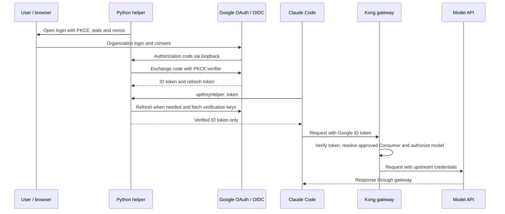

# Claude Code SSO Helper for Google Cloud Identity

[日本語の導入ガイド](docs/SETUP-GUIDE.ja.md) · [Setup guide](docs/SETUP-GUIDE.md) · [Security](SECURITY.md)

A Python `apiKeyHelper` that signs Google Workspace / Cloud Identity users in to Claude Code through a Kong gateway configured to accept Google ID tokens. It provides browser login, noninteractive token refresh, and local token validation without distributing upstream model API keys to users.

This is a community integration for the **Claude Code → gateway → model API** path. It does not configure Anthropic organization SSO or replace Claude's subscription login. Google, Anthropic, and Kong do not maintain this project.

## How it works



The gateway is an explicitly configured relying party for the dedicated Google OAuth client. The helper outputs a Google **ID token**, which the gateway must validate for that client's audience. It does not output Google's opaque API access token. The model provider uses separate credentials held by the gateway.

## Requirements

- macOS or Linux, Python 3.10+, and a browser on the same computer as the helper. Native Windows and remote/headless login are not supported.
- A Google Cloud project under the intended Workspace / Cloud Identity organization, an **Internal** OAuth app, and a **Desktop app** client JSON. See [Google's audience settings](https://support.google.com/cloud/answer/15549945?hl=en).
- Claude Code with `apiKeyHelper` support and an HTTPS gateway exposing the Anthropic Messages API.
- An existing Konnect AI Gateway v2 **CP (Control Plane), Model (AI Model), and Provider (AI Model Provider)**, with valid upstream credentials, the Model linked to its Provider, and a connected, running DP (Data Plane). Verify model requests through the gateway before adding SSO. This project does not provision these resources; see the [gateway prerequisites](docs/SETUP-GUIDE.md#prerequisites).
- A gateway deployment that can validate Google OIDC credentials and enforce user access. The bundled example targets Kong AI Gateway v2; the conventional [Kong OIDC plugin requires Enterprise](https://developer.konghq.com/plugins/openid-connect/). This repository does not include gateway software, entitlements or model access.

## Quick start

From the cloned repository root, after obtaining a Desktop client JSON:

```bash
python3 -m venv .venv
.venv/bin/python -m pip install .

export GOOGLE_CLAUDE_AUTH_MODE='oauth'
unset GOOGLE_CLAUDE_CLIENT_ID
export GOOGLE_CLAUDE_CLIENT_FILE='/absolute/path/client_secret_desktop.json'
export GOOGLE_CLAUDE_DOMAINS='example.com'
export GOOGLE_CLAUDE_ACCOUNT='user@example.com'
export CLAUDE_CODE_API_KEY_HELPER_TTL_MS='300000'

.venv/bin/google-claude-auth login
.venv/bin/google-claude-auth status
```

`status` shows verified identity claims, never the token. Have the gateway administrator verify and enroll the user's `sub` under the approved-user policy. Follow the [setup guide](docs/SETUP-GUIDE.md) to configure the gateway. Section 4 provides [field-by-field editing and installation instructions](docs/SETUP-GUIDE.md#4-configure-claude-code) for [claude-settings.example.json](examples/claude-settings.example.json), including how to preserve existing settings. Replace every example path, account, domain and URL. Keep terminal and Claude Code helper settings consistent so they use the same token cache.

The example configures `token --auto-login`: when Claude Code requests a credential, the helper uses its cache or refreshes the token, and opens Google login only if no complete login is cached or Google rejects the refresh with `invalid_grant`. Users already enrolled at the gateway can complete their first login this way without running `login` separately. Account selection, consent and MFA still happen in the browser. Plain `token` remains noninteractive. Helper stdout contains only the credential, and Claude Code's default credential cache lifetime is five minutes. See [Claude Code gateway authentication](https://code.claude.com/docs/en/llm-gateway-connect#rotate-credentials-with-apikeyhelper).

## Configuration

| Variable | Default / purpose |
| --- | --- |
| `GOOGLE_CLAUDE_AUTH_MODE` | `oauth`; `gcloud` is available for development compatibility |
| `GOOGLE_CLAUDE_CLIENT_FILE` | Required in OAuth mode: absolute path to Desktop client JSON |
| `GOOGLE_CLAUDE_CLIENT_ID` | Read from JSON in OAuth mode; if set, it must match. Required audience in gcloud mode |
| `GOOGLE_CLAUDE_DOMAINS` | Required: comma-separated allowed signed `hd` values; no wildcard |
| `GOOGLE_CLAUDE_ACCOUNT` | Optional pinned email in OAuth mode; required in gcloud mode |
| `GOOGLE_CLAUDE_CACHE_DIR` | `~/.claude/google-sso`; separate cache per mode/client/domains/account |
| `CLAUDE_CODE_API_KEY_HELPER_TTL_MS` | `300000`; supported range `0`–`300000` milliseconds |

Commands: `login`, `token` (default), `status`, and `logout`. `token --auto-login` enables browser authentication on demand in OAuth mode; omit `--auto-login` for unattended use. `login --no-browser` and `token --auto-login --no-browser` print the login URL to stderr but still need a callback on the same computer within 180 seconds. `logout` deletes the local cache only; the next auto-login request can start a new browser login.

Automatic login makes one browser attempt per invocation. Network, client configuration, token verification and corrupt/unsafe cache errors remain errors. Failed authentication preserves the previous cache. Automatic reauthentication must keep the cached Google subject; to intentionally change accounts, run `login` explicitly with the intended configuration. Simultaneous auto-login calls wait up to five minutes for the cache lock and reuse a completed login. See [automatic login setup and timeout behavior](docs/SETUP-GUIDE.md#automatic-login).

## Authorization and limitations

The helper verifies the Google signature, issuer, audience, token times, hosted domain, verified email and subject. It checks the login nonce and rejects a subject change during refresh. Tokens need more than the configured helper TTL plus 60 seconds of remaining validity.

**The gateway must enforce its own policy.** Users can bypass a local helper. The example requires registered Consumers identified by verified Google `sub`, with administrator-managed groups and model ACLs. Google OIDC does not supply the Okta-style `groups` claim assumed by some integrations; Google Groups synchronization is not implemented here.

The cache contains **plaintext refresh tokens**, protected by filesystem permissions. There is no keychain integration. Verification fetches Google's keys over HTTPS each time, so Google connectivity is required even for a cached token. See [security and revocation behavior](SECURITY.md).

## Validation

```bash
.venv/bin/python -m pip install -e '.[dev]'
.venv/bin/python -m ruff check .
.venv/bin/python -m ruff format --check .
.venv/bin/python -m pytest -v
```

The tests exercise real RSA signature verification, claim rejection, PKCE and loopback callbacks, refresh rotation, cache permissions, and stdout hygiene. Google responses are replaced with test fixtures; no real account is required.

The dedicated Desktop OAuth login/refresh flow, Claude Code startup, and the sample gateway's authorization policies require validation in your deployment. No customer-specific live results are included as certification of this setup. An opt-in [gateway probe](src/google_claude_auth/verify_gateway.py) checks missing, tampered and valid tokens; its valid case invokes a model. See [validation steps](docs/SETUP-GUIDE.md#validation).

## Contributing and license

The project uses a `src/` package layout, pytest for tests and Ruff for linting and formatting. Project metadata, dependencies and tool settings are defined in `pyproject.toml`.

```text
.
├── pyproject.toml
├── src/google_claude_auth/
│   ├── __init__.py
│   ├── __main__.py
│   ├── auth.py
│   └── verify_gateway.py
├── tests/
│   └── test_auth.py
├── examples/
│   ├── claude-settings.example.json
│   └── kongctl-oidc.example.yaml
├── docs/
│   ├── SETUP-GUIDE.md
│   └── SETUP-GUIDE.ja.md
└── .github/workflows/ci.yml
```

See [CONTRIBUTING.md](CONTRIBUTING.md) and [SECURITY.md](SECURITY.md). Licensed under the [MIT License](LICENSE).
